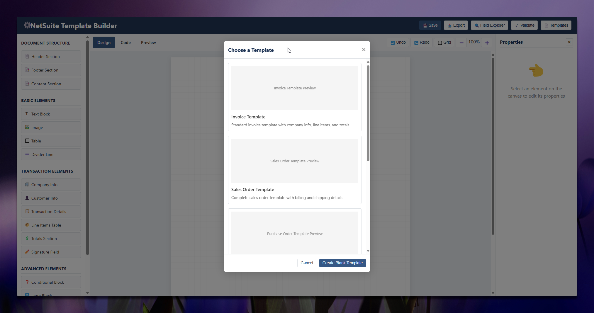

# NetSuite BFO/FreeMarker Template Builder

A drag-and-drop visual editor for creating NetSuite Advanced PDF templates that combine BFO (Business Forms Oriented) library and FreeMarker templating syntax.

## Features

- **Visual Drag & Drop Interface** - Design templates visually with no coding required
- **Pre-built Components** - Quickly add common NetSuite transaction elements
- **NetSuite Field Explorer** - Browse and insert field references with ease
- **Template Validation** - Check your template for errors and compliance
- **Import/Export** - Import existing templates or export as NetSuite XML/PDF
- **Version Management** - Save and restore different versions of your work

## Getting Started

1. Choose a template or start from scratch
2. Drag components from the left sidebar onto your canvas
3. Edit properties in the right panel
4. Preview or export your template when finished

## Key Components

- **Document Structure** - Headers, footers, content sections
- **Transaction Elements** - Company info, customer details, line items, totals
- **Advanced Elements** - Conditional blocks, loops, custom FreeMarker code

## Usage

The template builder creates standards-compliant NetSuite Advanced PDF templates. Simply export your completed template and upload it to NetSuite following the standard template upload process.

## License

MIT License - Feel free to use and modify for your own needs.